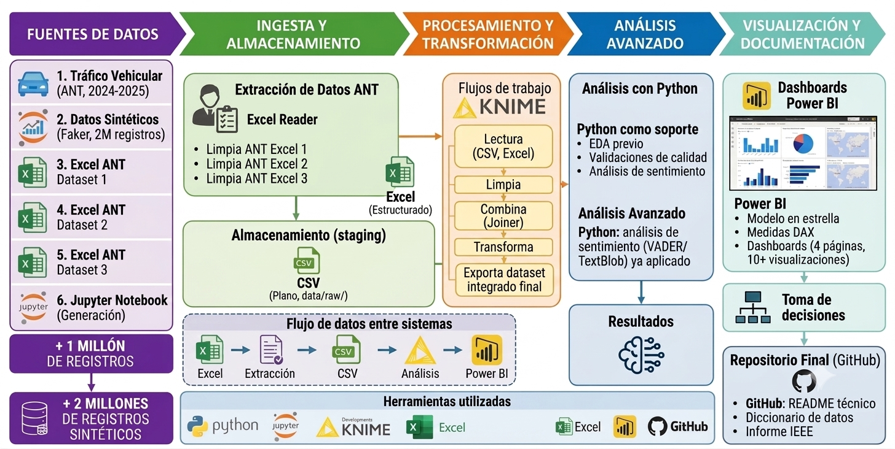

<div align="center">

# 🚦 Análisis de Siniestros de Tránsito en Ecuador

### Pipeline de datos: Fuentes → Ingesta → Transformación (KNIME) → Análisis (Python) → Visualización (Power BI)


</div>

---

##  Descripción general

Proyecto de análisis de siniestros de tránsito en Ecuador, que integra **más de 3 millones de registros** provenientes de fuentes reales (ANT) y datos sintéticos generados con Faker, a través de un pipeline completo: ingesta y almacenamiento, procesamiento y transformación (ETL en KNIME), análisis avanzado con Python, y visualización final en dashboards interactivos de Power BI.

---

## Arquitectura del proyecto



**+3 millones de registros** procesados en total (~1M de fuentes reales ANT + ~2M de datos sintéticos generados con Faker).

---

## 1 Fuentes de datos

| Fuente | Tipo | Descripción |
|---|---|---|
| Tráfico Vehicular (ANT, 2024–2025) | Real | Registros de tránsito de la Agencia Nacional de Tránsito |
| Datos Sintéticos (Faker) | Sintético | ~2M de registros generados para complementar el análisis |
| Excel ANT — Dataset 1, 2, 3 | Real | Bases de siniestros por periodo/año |
| Jupyter Notebook | Generación | Script de generación de datos sintéticos |

---

## 2 Ingesta y almacenamiento

- **Extracción de datos ANT** mediante `Excel Reader` en KNIME, con limpieza independiente por archivo (Excel 1, 2 y 3) antes de cualquier unión, para aislar y documentar los problemas propios de cada fuente.
- **Almacenamiento en staging**: los datos ya extraídos se dejan en formato **CSV plano** (`data/raw/`) como capa intermedia antes de la transformación, garantizando trazabilidad y reproducibilidad del proceso.

```
Excel → Extracción → CSV (staging) → Análisis → Power BI
```

---

## 3 Procesamiento y transformación — KNIME

Flujo de trabajo ETL construido en **KNIME Analytics Platform**:

```
Lectura (CSV, Excel) → Limpieza → Combinación (Joiner) → Transformación → Exportación del dataset integrado
```

### Principales acciones de limpieza aplicadas

| Problema detectado | Tratamiento |
|---|---|
| **70.9%** de filas duplicadas en una de las fuentes | `Duplicate Row Filter` |
| Códigos centinela (`-1`, `-9`, `125`) en edad | `Rule Engine` → conversión a valor nulo explícito |
| Formato ancho (hasta 13 columnas repetidas por vehículo, 3 por persona) | `Unpivot` → normalización a tablas relacionales (Personas, Vehículos) |
| Tipos de dato incorrectos (fecha/hora como texto) | `String to Date&Time`, `String to Number` |
| Inconsistencias de texto entre fuentes | `String Manipulation` (estandarización) |
| Outliers estadísticos en edad | `Numeric Outliers` (método IQR) |
| Duplicados entre fuentes tras la unión | Segunda pasada de `Duplicate Row Filter` post-`Concatenate` |

📁 Workflow: [`/knime_workflow/`](./knime_workflow)

---

## 4 Análisis avanzado — Python

- **EDA previo y validaciones de calidad**: soporte en Python para perfilar el dataset antes y después de la limpieza en KNIME (conteo de nulos, duplicados, outliers).
- **Análisis de sentimiento** (VADER / TextBlob): aplicado sobre campos de texto libre disponibles en el dataset, como insumo adicional de análisis avanzado.

 Notebooks: [`/notebooks/`](./notebooks)

---

## 5 Visualización y documentación — Power BI

- **Modelo en estrella**, con tablas de hechos y dimensiones relacionadas por el identificador del siniestro.
- **Medidas DAX** (mínimo 8), incluyendo KPI principal, indicador de tendencia, ranking y variación porcentual.
- **Dashboards**: 4 páginas, 10+ visualizaciones no repetitivas, 4 segmentadores (fecha, ubicación, categoría, fuente) y 3 KPIs principales con interpretación.

 Dashboard: [`/powerbi/`](./powerbi)

### Documentación del repositorio
- `README.md` técnico (este documento)
- Diccionario de datos: [`/docs/diccionario_datos.md`](./docs)
- Informe final formato IEEE: [`/docs/informe_IEEE.pdf`](./docs)

---

## Hallazgos clave y recomendaciones

| Hallazgo | Recomendación |
|---|---|
| Fuerte concentración de siniestros en Guayas y Pichincha | Priorizar recursos de control vial de forma focalizada, no uniforme |
| Causas principales asociadas a comportamiento del conductor (mala conducción, adelantamiento indebido, no ceder el paso) | Priorizar intervenciones educativas y de fiscalización sobre inversión únicamente en infraestructura |
| Predominancia del sexo masculino en los siniestros | Campañas de concientización vial segmentadas por perfil de conductor |
| Choque lateral y atropello como tipos más frecuentes | Revisar semaforización/señalética en intersecciones y mejorar infraestructura peatonal en zonas urbanas |

---

## Conclusiones

- El diagnóstico inicial evidenció problemas de calidad severos (70.9% de duplicados, códigos inválidos mezclados con datos reales) que, de no tratarse, habrían distorsionado cualquier análisis posterior.
- Procesar cada fuente de forma independiente antes de unirla permitió aislar y documentar los errores propios de cada una, evitando contaminar el diagnóstico entre fuentes.
- La normalización estructural mediante `Unpivot` resolvió el problema de falsos valores nulos generados por el formato ancho original.
- El resultado es un conjunto de datos trazable, con distinción explícita entre dato real y sintético, integrado en un pipeline reproducible desde la fuente hasta el dashboard final.
- El análisis sugiere que la siniestralidad vial está más asociada a **factores conductuales prevenibles** que a causas externas, orientando las recomendaciones hacia educación vial y control de comportamiento en zonas de alto riesgo.

---

## Herramientas utilizadas

<div align="center">

| Etapa | Herramienta |
|---|---|
| Generación y análisis de datos | Python, Jupyter Notebook, Faker |
| ETL / Limpieza | KNIME Analytics Platform |
| Almacenamiento | MongoDB / MySQL / Excel |
| Visualización | Power BI |
| Documentación y control de versiones | GitHub |

</div>

---

##  Estructura del repositorio

```
Proyecto_AnalisisdeDatos_Transito/
│
├── notebooks/              # Generación de datos sintéticos y EDA (Python/Faker)
├── knime_workflow/         # Workflow ETL (.knwf)
├── data/                   # CSV de staging y datos finales limpios
├── powerbi/                # Archivo .pbix del dashboard
├── docs/                   # Diccionario de datos e informe IEEE
└── README.md
```

---

##  Autoría

<div align="center">

| Rol | Responsable |
|---|---|
| Generación de datos (Python) | Emely Bone |
| Limpieza y ETL (KNIME) | Ariana Villota |
| Análisis avanzado y visualización (Python + Power BI) | Emely Bone y Ariana Villota |

</div>

---

<div align="center">


</div>
